  

<h1 align="center">Hi 👋, I'm Nagaraj Vatagal</h1>
<h3 align="center">Self-taught Full-Stack Developer | AI-powered Web Apps | MCA Student</h3>

  

---

### 👨‍💻 About Me

- 🎓 Pursuing **MCA** at Dayananda Sagar Academy of Technology and Management, Bengaluru (CGPA: 9.25)
- 🎓 Completed **BCA** from Basaveshwar Science College, Bagalkote (CGPA: 9.16)
- 🚀 Self-taught **Full-Stack Developer** building and deploying real-world projects independently
- 🤖 Passionate about integrating **Generative AI / LLMs** into practical web applications
- 🛠️ Comfortable across the stack: React/Vite frontends, Node.js/Express & Spring Boot backends, MySQL databases
- ☁️ Deploy end-to-end on Vercel, Render, Railway, and Aiven
- 🌱 Currently exploring deeper AI/ML integration and scalable backend architecture
- 🎯 Goal: Build intelligent, production-ready systems that solve real problems

---

### 🛠️ Tech Stack

**Languages**

  
  
  

**Frontend**

  
  
  
  

**Backend**

  
  
  

**Database & Cloud**

  
  
  
  

**AI / Generative AI**

  
  

**Tools**

  
  
  
  

---

### 📊 GitHub Stats

  
  

  

---

### 🚀 Featured Projects

**[AI College Complaint Redressal System](https://github.com/nagarajvatagal87-debug/AI-College_Complaints_Redressal-_System)**
Three-portal (Student/Admin/Staff) complaint system with AI-based auto-assignment, priority tagging, and sentiment analysis on feedback.
🔗 [Live Demo](https://ai-college-complaints-redressal-sys-pi.vercel.app/) · Stack: React, Node.js, Express, MySQL, AI/NLP

**[AI-Powered Data Visualization Dashboard](https://github.com/nagarajvatagal87-debug/Smart-CSV-AI_Dashboard)**
Upload any CSV and get AI-recommended charts, auto-cleaned data, and interactive visualizations — no queries needed.
🔗 [Live Demo](https://smart-csv-ai-dashboard.vercel.app/) · Stack: Java, Spring Boot, DeepSeek LLM

**[Personal Portfolio Website](https://github.com/nagarajvatagal87-debug/Updated_Portfolio)**
Fully responsive portfolio with typing hero effect, particle background, and multi-image project carousels.
🔗 [Live Demo](https://updated-portfolio-iota-coral.vercel.app/) · Stack: HTML, CSS, JavaScript

---

### 🌐 Connect with Me

  
  
  

  

